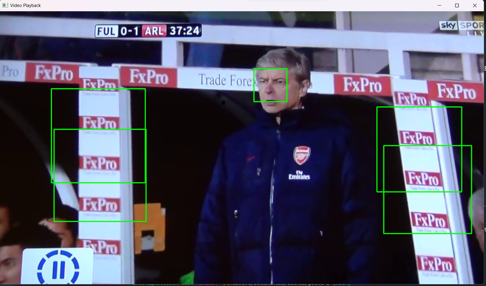

# Descrição

Para estruturação do código, utilizei o haar_cascade para fazer o modelo detecção das faces, além de utilizar o código de reproduzir_video.py como base. Para isso, segui os seguintes passos:

1. Importei o vídeo em questão;
2. Peguei o tamnho do video de largura e altura.
3. Importei o haar_cascade.xml
4. Defini o size do video;
5. Define o codec e cria o arquivo de video de saida

Depois criei um laço de loop do tipo While, para pegar e rodar cada frame recebido. E realizei a seguinte operação:

1. Le o frame de entrada;
2. Verifiquei com um If se conseguiu ler o frame;
3. Tranformei a imagem em cinza;
4. Utilizei o haar_cascade para fazer a detecção multipla na imagem em cinza;
5. Criei um for responsavel por desenhar o retangulo de marcação na face;
6. Salvei o video de saida
7. E exibi o vídeo em tempo real;
8. Coloquei uma tecla de saida na letra Q do teclado
9. E setei para fechar as janelas

Dessa forma resultado em:

